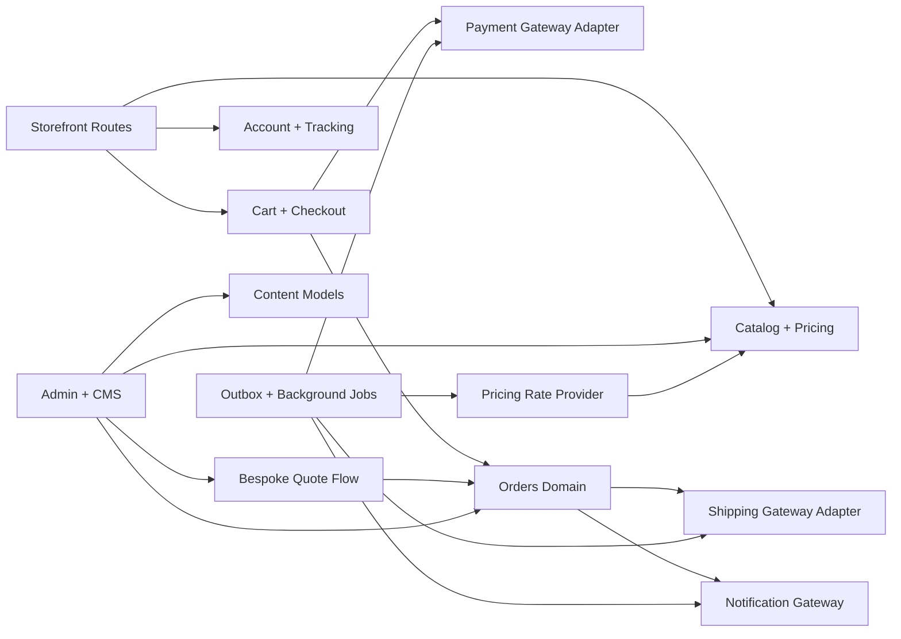

# Architecture Overview

## Purpose

VAIDHURYA should evolve from a visually complete landing experience into a real premium jewelry commerce platform without changing the established theme language. The current storefront already defines the desired brand expression; the architecture must extend that experience into operational commerce rather than replace it with a generic template.

## Non-Negotiable Design Constraint

All new shopper and admin-facing pages that surface brand content must reuse the existing luxury UI primitives already present in the repo:

- existing serif display typography and body font pairing
- current bridal/everyday palette, gradients, and premium surface treatment
- current header treatment, announcement rhythm, and collection-card styling
- the same premium visual tone for cart, checkout, account, and content-managed merchandising blocks

This is a commerce expansion, not a redesign project.

## System Shape

The v1 system is a modular `Next.js 16` monolith with App Router boundaries around storefront, checkout, account, admin, and integrations. The data foundation is Supabase-style `Postgres + Auth + Storage`, with domain modules separated well enough to extract later if scale or organizational boundaries require it.



## Route Groups

The recommended route layout is:

```text
app/
  (marketing)/
    page.tsx
    collections/[slug]/page.tsx
    products/[slug]/page.tsx
  (commerce)/
    cart/page.tsx
    checkout/page.tsx
    checkout/confirmation/[orderNumber]/page.tsx
    track/page.tsx
    bespoke/page.tsx
  (account)/
    account/page.tsx
    account/orders/page.tsx
    account/orders/[orderNumber]/page.tsx
    wishlist/page.tsx
  (admin)/
    admin/page.tsx
    admin/catalog/page.tsx
    admin/orders/page.tsx
    admin/shipments/page.tsx
    admin/cms/page.tsx
  api/
    cart/*
    checkout/*
    orders/*
    tracking/*
    bespoke/*
    admin/*
    webhooks/*
```

This keeps the marketing and shopper experience close to the current repo structure while isolating operational and integration surfaces.

## Responsibility Split

### Server-first responsibilities

- collection, product, and CMS reads
- dynamic price computation from stored metal-rate snapshots
- cart persistence and checkout session creation
- payment intent setup, confirmation verification, and order creation
- shipment creation, tracking sync, return authorization, and refund orchestration
- admin mutations, audit logging, and permission enforcement

### Client responsibilities

- theme-preserving interactive browse experiences
- cart quantity controls and optimistic UI around validated server mutations
- payment field rendering where the chosen gateway requires browser-side tokenization
- account dashboards, tracking timeline interactions, and bespoke request submission forms

## Major Domain Modules

| Module | Owns | Notes |
| --- | --- | --- |
| `catalog` | collections, products, variants, certifications, merchandising flags | Storefront and admin both read it |
| `pricing` | metal-rate snapshots, formulas, computed prices, checkout locks | Browse remains dynamic until checkout lock |
| `cart` | anonymous and authenticated shopping carts | Anonymous cart should be resumable via signed cookie |
| `checkout` | checkout session, address capture, tax/shipping quote, payment preparation | The only place where payable amount becomes fixed |
| `orders` | order creation, line-item snapshots, status changes, returns, refunds | Persists final economic state of each purchase |
| `shipping` | fulfillment packages, tracking numbers, carrier events | Supports partial and split shipments |
| `bespoke` | custom inquiry intake, quote revisions, quote acceptance, payment links | Separate from standard catalog checkout |
| `admin` | role-based staff tools and audit history | Core operational control plane |
| `cms` | homepage sections, banners, landing content, gifting/certification copy | Must preserve the storefront design system |
| `integrations` | payment, shipping, rates, notifications | Provider-agnostic boundary layer |

## Data and Platform Foundation

The platform should use:

- `Postgres` for transactional commerce data
- Supabase Auth for customer and staff identity
- object storage for product media, certificates, gifting assets, and bespoke reference uploads
- an ORM such as Drizzle for schema ownership and migrations
- boundary validation with `Zod` or equivalent for server actions, route handlers, webhooks, and admin forms

## Async and Background Work

Not every operational task should run inline with the shopper request. The architecture assumes an outbox/job pattern for:

- metal-rate snapshot refresh
- payment webhook reconciliation
- shipment creation retries and tracking refresh
- notification dispatch
- refund follow-up and return-state propagation
- analytics event projection

This avoids tight coupling to external providers and makes failed work retryable without duplicating orders or notifications.

## Extractable Boundaries

The monolith should be organized so later service extraction is possible without changing user-facing behavior:

- `pricing` can become a dedicated rate and quote service
- `orders + shipping` can become an operations service
- `cms` can move behind separate publishing infrastructure if editorial needs grow
- `bespoke` can expand into a specialized assisted-sales workflow without rewriting catalog checkout

The initial implementation stays in one codebase to reduce coordination overhead and preserve speed.
