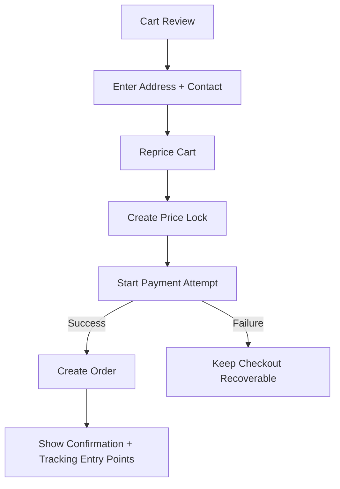

# Commerce Flows

This document describes the shopper and post-purchase behaviors the platform must support. The route and data assumptions here depend on [Architecture Overview](./architecture-overview.md) and [Domain Model](./domain-model.md).

## 1. Standard Browse-To-Order Flow

1. Shopper lands on the luxury storefront and browses curated collections without any visual redesign from the current theme.
2. Collection listing resolves products, CMS-managed merchandising blocks, and dynamic browse prices.
3. PDP shows variant choices, gifting availability, certification/care details, delivery expectations, and custom-order eligibility when applicable.
4. Shopper adds one or more variants to cart.
5. Cart shows latest known prices, gifting selections, estimated shipping, and a warning that final pricing locks during checkout.
6. Checkout captures shipping, billing, contact details, and recalculates tax, shipping, and metal-rate-based totals.
7. System creates a `PriceLock`, then prepares a payment attempt.
8. Successful payment creates the order, snapshots line items, and routes the shopper to order confirmation.

## 2. Checkout Flow Details

Rules:

- Guests can complete checkout without creating an account.
- The system must not create an order before payment is confirmed or otherwise authorized according to the chosen gateway contract.
- Payment retries should create new `PaymentAttempt` records while preserving the same checkout session and price lock if the lock is still valid.
- If the lock expires before payment succeeds, checkout must reprice and generate a fresh lock before retrying.

## 3. Payment Card Flow

The v1 checkout flow is card-first even though the gateway remains provider-agnostic.

Required behavior:

- tokenize or capture payment details through the chosen provider boundary rather than storing raw card data
- create a payment intent or equivalent provider-side attempt before final confirmation
- persist provider references and idempotency keys for every payment attempt
- reconcile asynchronous payment updates through webhooks or callback handlers
- show clear recovery states for failed, abandoned, and uncertain payments

Failure handling:

- `declined`: return shopper to payment step with preserved checkout state
- `timed_out`: mark attempt as unknown/pending until reconciliation confirms outcome
- `duplicate_submit`: block duplicate order creation using checkout and payment idempotency keys

## 4. Order Confirmation And Lookup

After successful payment:

1. Generate an `Order` with immutable item and price snapshots.
2. Send confirmation via notification adapter with item summary, gifting details, and next-step expectations.
3. Surface guest order lookup using order number and shopper verification factor.
4. Offer optional account creation that attaches the order history later.

The confirmation view should surface:

- order number
- payment confirmation state
- line-item and gifting summary
- certificate and care content references
- shipment status placeholder until fulfillment begins

## 5. Shipment Tracking Flow

Shipment tracking must work for both account holders and guests.

1. Operations create one or more shipments for an order.
2. Each shipment receives a carrier reference and tracking number through the shipping adapter.
3. Carrier updates or internal fulfillment changes append `TrackingEvent` records.
4. The storefront exposes a timeline grouped by package, not only by order.

Tracking states that must be represented:

- label created
- packed
- handed to carrier
- in transit
- out for delivery
- delivered
- delayed or exception
- canceled shipment

If an order has multiple packages, the order page must show both aggregate fulfillment status and per-package timelines.

## 6. Returns And Refunds

Standard ready-stock items should support controlled self-service return initiation.

Flow:

1. Shopper opens a return request from order detail or guest lookup.
2. System validates item eligibility and return window.
3. Operations approve, reject, or request more information.
4. Refund is issued only after policy conditions are satisfied and tied to the original payment record.

Rules:

- returns may be partial at item level
- refunds may be partial and must map to a specific payment attempt
- return and refund state must remain visible in order history and admin tools
- bespoke/custom orders follow stricter rules and usually route through support-managed exceptions

## 7. Bespoke Inquiry-To-Quote Flow

Bespoke is not part of the instant cart flow. It is a guided assisted-sales path.

1. Shopper opens the bespoke request page.
2. Shopper submits occasion, product category, inspiration, budget range, size or preference details, and optional reference uploads.
3. Admin reviews the request and creates a quote with material summary, price, deposit requirement, and estimated completion timeline.
4. If revisions are needed, the quote is versioned instead of overwritten.
5. Shopper accepts the quote and pays through a quote-specific payment path.
6. Accepted quote converts into the core order lifecycle for downstream fulfillment and tracking.

Required states:

- inquiry received
- under review
- quote issued
- quote revised
- accepted
- declined or expired
- converted to production order

## 8. Premium Jewelry Workflows

### Certification visibility

- PDP must clearly show that certification or authenticity documentation is available when applicable.
- Order confirmation and order detail must preserve certificate references captured at purchase time.

### Gifting

- Cart and checkout must allow gift wrap selection and gift note entry when the product supports it.
- Gift choices must be preserved into `OrderItem` snapshots and operations views.
- Shipment documents and customer communication must respect gift mode where applicable.

### Premium post-purchase communication

- Confirmation, shipping, delay, delivery, return, and refund communications should use brand-consistent language and premium content blocks.
- Notification content should be sourced from CMS-managed templates or reusable content sections, not hard-coded strings scattered across the app.

## 9. Failure And Recovery Paths

### Rate changes during checkout

- If prices change before lock creation, checkout uses the newest valid price and clearly refreshes totals.
- If prices change after lock creation, the in-progress payment continues using the lock until it expires.

### Partial shipment

- One order can move to partially fulfilled while some items remain pending or bespoke.
- Tracking must never imply that the entire order is delivered if only one package is complete.

### Canceled shipment

- If a shipment is voided before dispatch, the order returns to an operations-needed state without losing the order itself.
- Replacement shipment creation should produce a new shipment record, not mutate history destructively.

### Refund handling

- Refund success updates customer-visible order state and triggers communication.
- Refund failure remains visible to operations and must not falsely close the return case.
