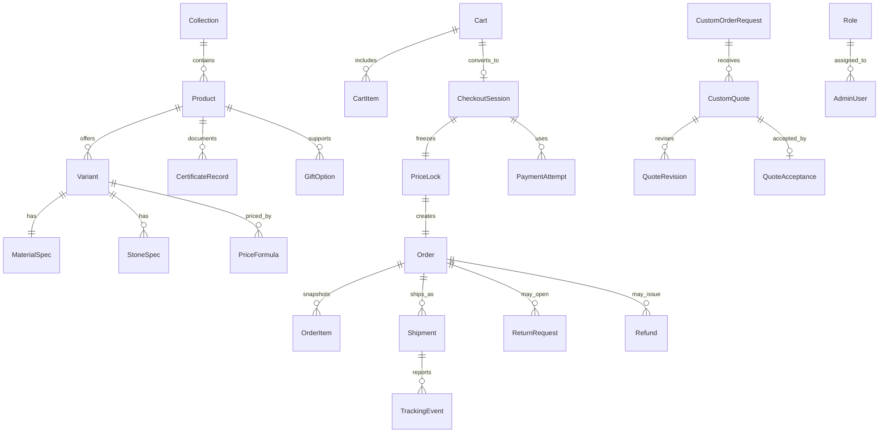

# Domain Model

## Model Principles

- Catalog browsing may show dynamically computed prices.
- The payable amount is not final until checkout submission or payment intent creation locks the price snapshot.
- Orders are immutable economic records once created; later state changes happen through shipments, returns, refunds, and audit events.
- Guest checkout is a first-class path, not a degraded fallback.
- Bespoke orders are inquiry-led and quote-managed rather than instant-configured.
- Orders may produce multiple shipments and multiple tracking timelines.

## Core Entities

### Catalog and merchandising

| Entity | Purpose | Key fields |
| --- | --- | --- |
| `Collection` | Merchandising grouping for themed product discovery | `slug`, `title`, `theme`, `heroContentRef`, `sortOrder`, `isPublished` |
| `Product` | Sellable jewelry family shown on PDP | `slug`, `title`, `description`, `category`, `productType`, `theme`, `customizable`, `status` |
| `Variant` | Specific purchasable SKU | `sku`, `productId`, `material`, `finish`, `size`, `stoneProfile`, `inventoryMode`, `baseMakingCharge`, `status` |
| `MaterialSpec` | Metal composition and purity details | `variantId`, `metalType`, `purity`, `weightGrams`, `coatingType` |
| `StoneSpec` | Stone composition and grading details | `variantId`, `stoneType`, `quantity`, `caratWeight`, `gradeNotes` |
| `CertificateRecord` | Authenticity and care documentation | `productId`, `issuer`, `certificateType`, `documentRef`, `careCopyRef` |
| `GiftOption` | Premium gifting configuration | `productId`, `boxType`, `giftWrapAvailable`, `giftNoteAllowed`, `surchargeAmount` |
| `ContentSection` | CMS-managed merchandising block | `placement`, `theme`, `sectionType`, `payload`, `publishState` |

### Pricing and checkout economics

| Entity | Purpose | Key fields |
| --- | --- | --- |
| `MetalRateSnapshot` | Stored market rate used for calculations | `metalType`, `currency`, `ratePerGram`, `source`, `capturedAt`, `version` |
| `PriceFormula` | Rules for turning materials and labor into sell price | `variantId`, `makingChargeRule`, `stoneChargeRule`, `marginRule`, `taxClass` |
| `ComputedPrice` | Latest browse-time price output | `variantId`, `snapshotVersion`, `subtotal`, `taxEstimate`, `displayPrice`, `computedAt` |
| `Cart` | Active shopper basket | `cartId`, `customerId?`, `guestToken`, `currency`, `status`, `expiresAt` |
| `CartItem` | Intended purchase before checkout | `cartId`, `variantId`, `quantity`, `giftSelection`, `displayPriceSnapshot` |
| `CheckoutSession` | Pre-order transactional session | `checkoutId`, `cartId`, `billingAddress`, `shippingAddress`, `taxQuote`, `shippingQuote`, `priceLockId`, `status` |
| `PriceLock` | Final economic snapshot for payment and order creation | `priceLockId`, `checkoutId`, `lockedAt`, `expiresAt`, `lineTotals`, `grandTotal`, `snapshotVersion` |

### Payments, orders, and fulfillment

| Entity | Purpose | Key fields |
| --- | --- | --- |
| `PaymentAttempt` | Record of each payment initiation or retry | `paymentAttemptId`, `checkoutId`, `provider`, `providerReference`, `amount`, `status`, `idempotencyKey` |
| `Order` | Completed commercial transaction | `orderId`, `orderNumber`, `customerId?`, `guestEmail`, `priceLockId`, `paymentState`, `fulfillmentState`, `orderState` |
| `OrderItem` | Immutable line-item snapshot at purchase time | `orderId`, `variantSnapshot`, `quantity`, `lockedUnitPrice`, `giftSnapshot`, `certificateSnapshot` |
| `Shipment` | A physical package associated with an order | `shipmentId`, `orderId`, `shipmentNumber`, `carrier`, `trackingNumber`, `shipmentState`, `packageContents` |
| `TrackingEvent` | Carrier-sourced or internal shipment update | `shipmentId`, `eventType`, `description`, `eventAt`, `location`, `source` |
| `ReturnRequest` | Customer-initiated or support-created return case | `returnId`, `orderId`, `orderItemIds`, `reason`, `status`, `requestedAt` |
| `Refund` | Monetary return tied to payment and return state | `refundId`, `orderId`, `paymentAttemptId`, `amount`, `reason`, `status`, `processedAt` |

### Bespoke and assisted selling

| Entity | Purpose | Key fields |
| --- | --- | --- |
| `CustomOrderRequest` | Initial bespoke inquiry | `requestId`, `customerIdentity`, `category`, `brief`, `budgetRange`, `occasion`, `referenceUploads`, `status` |
| `CustomQuote` | Admin-issued proposal for a bespoke piece | `quoteId`, `requestId`, `quoteNumber`, `materialsSummary`, `price`, `depositRequired`, `deliveryEstimate`, `status` |
| `QuoteRevision` | Version history of quote changes | `quoteId`, `revisionNumber`, `changeSummary`, `price`, `timeline`, `revisedBy`, `revisedAt` |
| `QuoteAcceptance` | Customer approval of a quote | `quoteId`, `acceptedAt`, `acceptedTermsVersion`, `paymentPath`, `status` |

### Identity, admin, and control

| Entity | Purpose | Key fields |
| --- | --- | --- |
| `Customer` | Registered shopper profile | `customerId`, `email`, `phone`, `authUserId`, `defaultAddressId`, `marketingConsent` |
| `Address` | Shipping or billing destination | `addressId`, `customerId?`, `name`, `line1`, `city`, `state`, `postalCode`, `country`, `phone` |
| `AdminUser` | Internal operator | `adminUserId`, `authUserId`, `displayName`, `roleId`, `status` |
| `Role` | Staff authorization grouping | `roleId`, `name`, `permissionSet` |
| `AuditLog` | Immutable admin action record | `auditId`, `actorId`, `resourceType`, `resourceId`, `action`, `beforeState`, `afterState`, `occurredAt` |

## Relationship Map

## Lifecycle Rules

### Price lifecycle

1. A product page reads the latest applicable `MetalRateSnapshot`.
2. The system computes browse-time pricing using `PriceFormula` and surfaces `ComputedPrice`.
3. Cart data may store the displayed price for transparency, but it is not authoritative.
4. Checkout recalculates totals and creates a `PriceLock`.
5. Payment and order creation must only use the `PriceLock` snapshot.

### Guest checkout lifecycle

1. A guest shopper receives a signed cart token.
2. Cart and checkout persist against that guest identity without requiring account creation.
3. Order confirmation and tracking are accessible through secure lookup using order reference plus email or token.
4. Post-purchase account creation may attach existing guest orders to a new `Customer` record.

### Fulfillment lifecycle

1. An order may be split into one or more `Shipment` records.
2. Each shipment owns its own tracking number and event timeline.
3. Order fulfillment state is derived from shipment state, not a single order-level flag.
4. Partial shipment is valid and expected for mixed availability, gifting, or bespoke combinations.

### Bespoke lifecycle

1. A customer submits `CustomOrderRequest`.
2. Admin staff review and produce a `CustomQuote`.
3. Any material or timeline changes produce `QuoteRevision` history, not silent edits.
4. Acceptance triggers payment collection through a quote-specific payment path.
5. If the quote converts to production, downstream fulfillment still lands in the core `Order` and `Shipment` domains so reporting stays unified.
